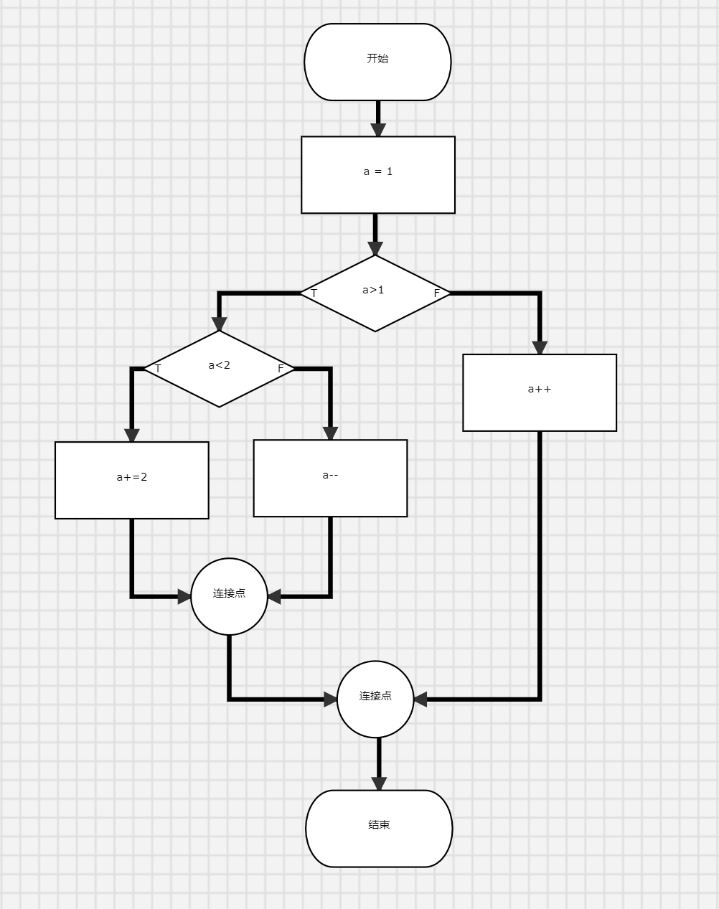
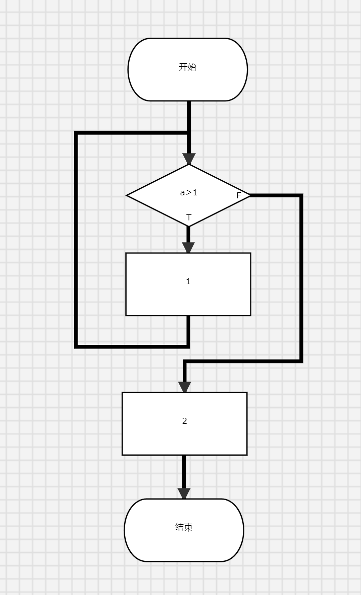
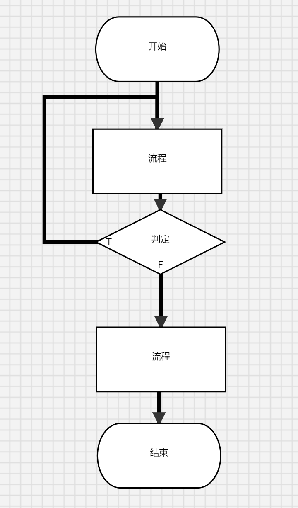

# OnlineFlowchartGenerator
An online Flowchart Generator to easily build your own flowchart. The project is developed and tested in Microsoft Edge browser.
## Live Demo:
- English_ver:http://101.42.248.14:800/flowchart_eng.html
- Chinese_ver:http://101.42.248.14:800/flowchart.html

## Features:
- Generate activity block by draging blocks into graph.
- Creat relation between blocks by click "link" and drag between two blocks.
- Change the text of block by double click it.
- Change the if branch block by clicking it and press tab.
- Scale up and down by scrolling.
- Delete graph.
- Import json to generate graph or dump graph into json.
- Dump the graph into C-language described Code, support if, while, and do-while structure.

## Examples:

### if-branch

- json:
```
{"nodes":[{"id":"8b9a4fe8-665a-4f1c-85cb-41cc5594e3a9","title":"开始","x":300,"y":150,"name":"startComponent","state":0},{"id":"22313090-7cb0-48d7-ab3e-bcd05e7e0a98","title":"a = 1\n","x":284.84429931640625,"y":272.30169677734375,"name":"activityComponent","state":0},{"id":"590a3f56-417a-44e0-9a44-5c61bea58bff","title":"a>1\n","x":281,"y":426.6131286621094,"name":"branchComponent","state":0},{"id":"07c10829-2581-47a9-b165-73474b923565","title":"连接点","x":281.1772155761719,"y":956.3504028320312,"name":"connecterComponent","state":0},{"id":"38c0b2ee-13a6-4733-b8dc-b02c24780a44","title":"a++","x":495.5377197265625,"y":556.3868408203125,"name":"activityComponent","state":0},{"id":"c45091a8-d6e3-452e-8928-b9a8427bd388","title":"结束","x":272.37725830078125,"y":1120.5072021484375,"name":"endComponent","state":0},{"id":"b765afda-a046-4fca-bd5f-d2a3ec8dddd6","title":"a<2","x":77.49570780346897,"y":525.1352540974738,"name":"branchComponent","state":0},{"id":"38149e9d-5dc0-445b-9047-a859e6f4173c","title":"a+=2","x":-36.48339750664667,"y":670.682418918798,"name":"activityComponent","state":0},{"id":"15071e80-d33e-4a8b-ae83-2199b072f03b","title":"a--","x":222.49170666613236,"y":668.0033233445831,"name":"activityComponent","state":0},{"id":"e394fb34-14b4-4219-ad69-c0d3f4f2c922","title":"连接点","x":90.5376832207292,"y":822.3424062666506,"name":"connecterComponent","state":0}],"edges":[{"source":{"id":"8b9a4fe8-665a-4f1c-85cb-41cc5594e3a9","title":"开始","x":300,"y":150,"name":"startComponent","state":0},"target":{"id":"22313090-7cb0-48d7-ab3e-bcd05e7e0a98","title":"a = 1\n","x":284.84429931640625,"y":272.30169677734375,"name":"activityComponent","state":0}},{"source":{"id":"22313090-7cb0-48d7-ab3e-bcd05e7e0a98","title":"a = 1\n","x":284.84429931640625,"y":272.30169677734375,"name":"activityComponent","state":0},"target":{"id":"590a3f56-417a-44e0-9a44-5c61bea58bff","title":"a>1\n","x":281,"y":426.6131286621094,"name":"branchComponent","state":0}},{"source":{"id":"590a3f56-417a-44e0-9a44-5c61bea58bff","title":"a>1\n","x":281,"y":426.6131286621094,"name":"branchComponent","state":0},"target":{"id":"38c0b2ee-13a6-4733-b8dc-b02c24780a44","title":"a++","x":495.5377197265625,"y":556.3868408203125,"name":"activityComponent","state":0}},{"target":{"id":"07c10829-2581-47a9-b165-73474b923565","title":"连接点","x":281.1772155761719,"y":956.3504028320312,"name":"connecterComponent","state":0},"source":{"id":"38c0b2ee-13a6-4733-b8dc-b02c24780a44","title":"a++","x":495.5377197265625,"y":556.3868408203125,"name":"activityComponent","state":0}},{"source":{"id":"07c10829-2581-47a9-b165-73474b923565","title":"连接点","x":281.1772155761719,"y":956.3504028320312,"name":"connecterComponent","state":0},"target":{"id":"c45091a8-d6e3-452e-8928-b9a8427bd388","title":"结束","x":272.37725830078125,"y":1120.5072021484375,"name":"endComponent","state":0}},{"source":{"id":"590a3f56-417a-44e0-9a44-5c61bea58bff","title":"a>1\n","x":281,"y":426.6131286621094,"name":"branchComponent","state":0},"target":{"id":"b765afda-a046-4fca-bd5f-d2a3ec8dddd6","title":"a<2","x":77.49570780346897,"y":525.1352540974738,"name":"branchComponent","state":0}},{"source":{"id":"b765afda-a046-4fca-bd5f-d2a3ec8dddd6","title":"a<2","x":77.49570780346897,"y":525.1352540974738,"name":"branchComponent","state":0},"target":{"id":"38149e9d-5dc0-445b-9047-a859e6f4173c","title":"a+=2","x":-36.48339750664667,"y":670.682418918798,"name":"activityComponent","state":0}},{"source":{"id":"b765afda-a046-4fca-bd5f-d2a3ec8dddd6","title":"a<2","x":77.49570780346897,"y":525.1352540974738,"name":"branchComponent","state":0},"target":{"id":"15071e80-d33e-4a8b-ae83-2199b072f03b","title":"a--","x":222.49170666613236,"y":668.0033233445831,"name":"activityComponent","state":0}},{"source":{"id":"38149e9d-5dc0-445b-9047-a859e6f4173c","title":"a+=2","x":-36.48339750664667,"y":670.682418918798,"name":"activityComponent","state":0},"target":{"id":"e394fb34-14b4-4219-ad69-c0d3f4f2c922","title":"连接点","x":90.5376832207292,"y":822.3424062666506,"name":"connecterComponent","state":0}},{"source":{"id":"15071e80-d33e-4a8b-ae83-2199b072f03b","title":"a--","x":222.49170666613236,"y":668.0033233445831,"name":"activityComponent","state":0},"target":{"id":"e394fb34-14b4-4219-ad69-c0d3f4f2c922","title":"连接点","x":90.5376832207292,"y":822.3424062666506,"name":"connecterComponent","state":0}},{"target":{"id":"07c10829-2581-47a9-b165-73474b923565","title":"连接点","x":281.1772155761719,"y":956.3504028320312,"name":"connecterComponent","state":0},"source":{"id":"e394fb34-14b4-4219-ad69-c0d3f4f2c922","title":"连接点","x":90.5376832207292,"y":822.3424062666506,"name":"connecterComponent","state":0}}]}
```
- dumped code
```c++
#include<bits/stdc++.h>
int main(){
	a = 1;
	if( a>1 ){
		if( a<2 ){
			a+=2;
		}
		else{
			a--;
		}
	}
	else{
		a++;
	}
	return 0;
}
```
### while branch

- json
```
{"nodes":[{"id":"4e1abecb-fb58-40de-ad26-92931e366ad8","title":"1","x":370,"y":533,"name":"activityComponent","state":0},{"id":"ebb3151b-0278-4dca-b664-62fb77ff69a4","title":"a>1","x":371,"y":391,"name":"branchComponent","state":1},{"id":"42b33c7e-cd2a-4234-9461-b618c4bba005","title":"开始","x":369,"y":190,"name":"startComponent","state":0},{"id":"66c89703-fcf4-4c2c-9ea3-3d01fbaafb58","title":"2","x":364,"y":756,"name":"activityComponent","state":0},{"id":"480c53d8-5d8f-4934-8e3e-c26ebe28f855","title":"结束","x":363,"y":925.9999999999999,"name":"endComponent","state":0}],"edges":[{"source":{"id":"42b33c7e-cd2a-4234-9461-b618c4bba005","title":"开始","x":369,"y":190,"name":"startComponent","state":0},"target":{"id":"ebb3151b-0278-4dca-b664-62fb77ff69a4","title":"a>1","x":371,"y":391,"name":"branchComponent","state":1}},{"source":{"id":"ebb3151b-0278-4dca-b664-62fb77ff69a4","title":"a>1","x":371,"y":391,"name":"branchComponent","state":1},"target":{"id":"4e1abecb-fb58-40de-ad26-92931e366ad8","title":"1","x":370,"y":533,"name":"activityComponent","state":0}},{"source":{"id":"4e1abecb-fb58-40de-ad26-92931e366ad8","title":"1","x":370,"y":533,"name":"activityComponent","state":0},"target":{"id":"ebb3151b-0278-4dca-b664-62fb77ff69a4","title":"a>1","x":371,"y":391,"name":"branchComponent","state":1}},{"source":{"id":"ebb3151b-0278-4dca-b664-62fb77ff69a4","title":"a>1","x":371,"y":391,"name":"branchComponent","state":1},"target":{"id":"66c89703-fcf4-4c2c-9ea3-3d01fbaafb58","title":"2","x":364,"y":756,"name":"activityComponent","state":0}},{"source":{"id":"66c89703-fcf4-4c2c-9ea3-3d01fbaafb58","title":"2","x":364,"y":756,"name":"activityComponent","state":0},"target":{"id":"480c53d8-5d8f-4934-8e3e-c26ebe28f855","title":"结束","x":363,"y":925.9999999999999,"name":"endComponent","state":0}}]}
```
-dumped code
```c++
#include<bits/stdc++.h>
int main(){
	while( a>1 ){
		1;
	}
	2;
	return 0;
}
```
### do-while branch

- json
```
{"nodes":[{"id":"f3edc1f6-2fff-4c4b-8475-f4a96efd6a91","title":"判定","x":355,"y":369,"name":"branchComponent","state":2},{"id":"9d153e73-20e8-4b46-a405-9704aac6a6f8","title":"流程","x":352,"y":249,"name":"activityComponent","state":10},{"id":"7cdd9972-29db-41bc-8420-b59c606b4397","title":"流程","x":356,"y":551,"name":"activityComponent","state":0},{"id":"50b17241-51d6-40f9-abb7-a9073ca8c3d0","title":"结束","x":353,"y":700,"name":"endComponent","state":0},{"id":"69619be0-f961-426d-9d3b-1d966f6952ca","title":"开始","x":369,"y":82,"name":"startComponent","state":0}],"edges":[{"source":{"id":"69619be0-f961-426d-9d3b-1d966f6952ca","title":"开始","x":369,"y":82,"name":"startComponent","state":0},"target":{"id":"9d153e73-20e8-4b46-a405-9704aac6a6f8","title":"流程","x":352,"y":249,"name":"activityComponent","state":10}},{"source":{"id":"9d153e73-20e8-4b46-a405-9704aac6a6f8","title":"流程","x":352,"y":249,"name":"activityComponent","state":10},"target":{"id":"f3edc1f6-2fff-4c4b-8475-f4a96efd6a91","title":"判定","x":355,"y":369,"name":"branchComponent","state":2}},{"source":{"id":"f3edc1f6-2fff-4c4b-8475-f4a96efd6a91","title":"判定","x":355,"y":369,"name":"branchComponent","state":2},"target":{"id":"9d153e73-20e8-4b46-a405-9704aac6a6f8","title":"流程","x":352,"y":249,"name":"activityComponent","state":10}},{"source":{"id":"f3edc1f6-2fff-4c4b-8475-f4a96efd6a91","title":"判定","x":355,"y":369,"name":"branchComponent","state":2},"target":{"id":"7cdd9972-29db-41bc-8420-b59c606b4397","title":"流程","x":356,"y":551,"name":"activityComponent","state":0}},{"source":{"id":"7cdd9972-29db-41bc-8420-b59c606b4397","title":"流程","x":356,"y":551,"name":"activityComponent","state":0},"target":{"id":"50b17241-51d6-40f9-abb7-a9073ca8c3d0","title":"结束","x":353,"y":700,"name":"endComponent","state":0}}]}
```
- dumped code
```c++
#include<bits/stdc++.h>
int main(){
	do{
		流程;
	}while( 判定 )
	流程;
	return 0;
}
```

## Thanks to these open-source projects
- jquery.js
- d3.js 
- semantic.css 
- flow-chart 